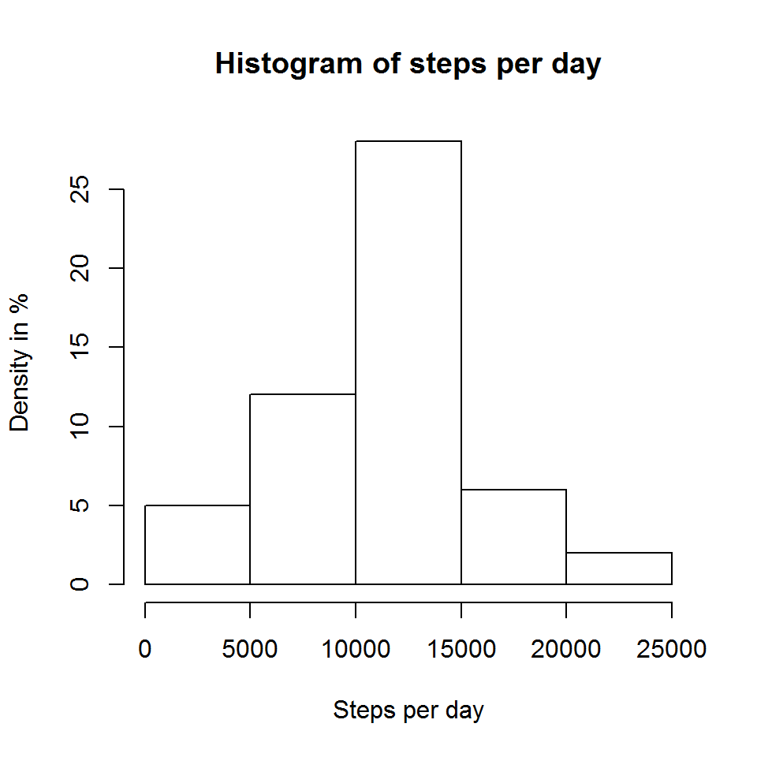
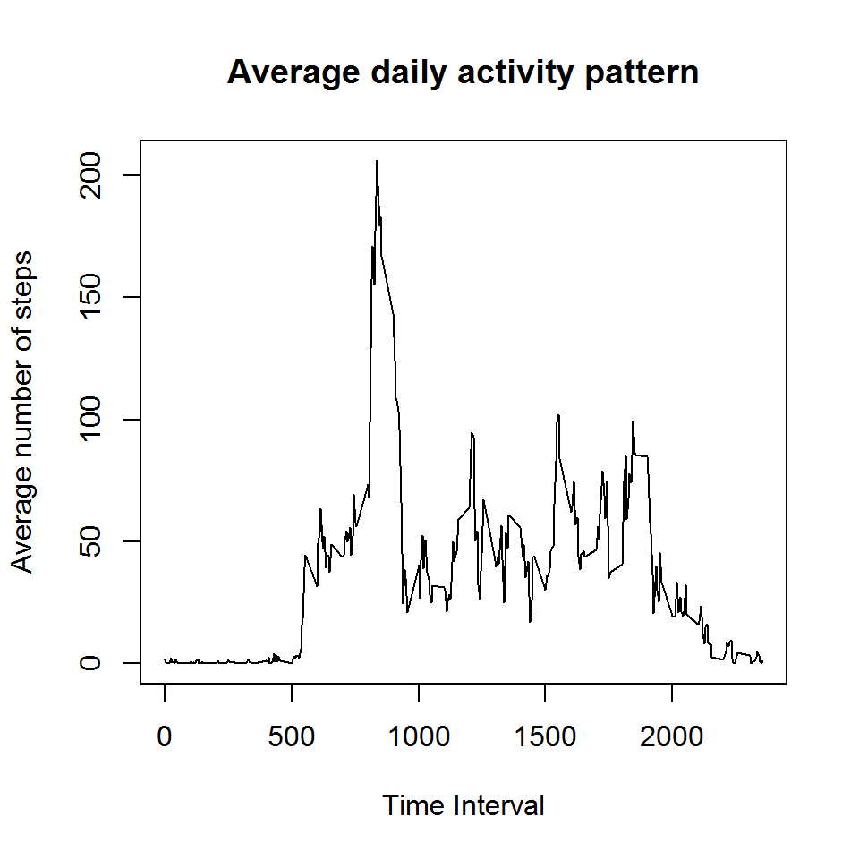
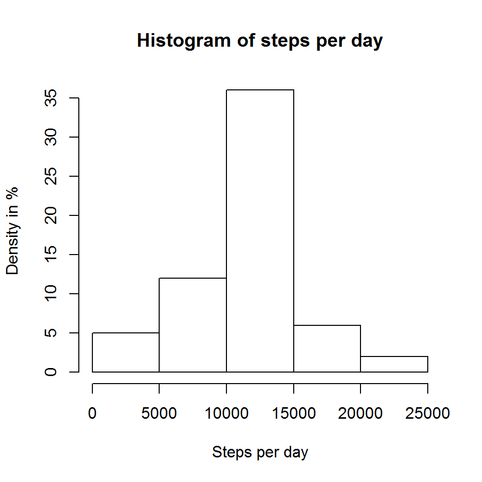
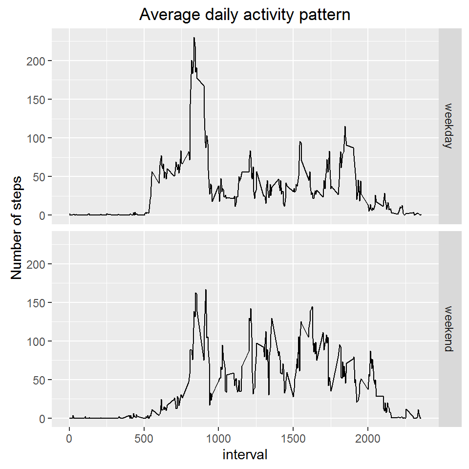

  
   

  
## Loading and preprocessing the data

In the code chunk below, we load and process the data


```r
activity_data <- read.csv(file = "./activity.csv")
```
  
## Calculating the mean number of steps taken per day

In the code chunk below, we calculate the mean of steps taken per day, and display the information on a histogram.


```r
steps_per_day <- aggregate(activity_data$steps, by = list(activity_data$date), FUN = sum)

hist(steps_per_day$x, 
     main = "Histogram of steps per day", 
     xlab = "Steps per day",
     ylab ="Density in %")
```


  
We will now calculate the mean of steps taken per day.

```r
mean(steps_per_day$x, na.rm = TRUE)
```

```
## [1] 10766.19
```
  

And let's have a look at the median of steps taken per day too.

```r
median(steps_per_day$x, na.rm = TRUE)
```

```
## [1] 10765
```

  
## Average daily activity pattern

We now wish to see the average daily activity pattern: mean number of steps per time interval.

```r
average_daily_activity_pattern <- aggregate(activity_data$steps, by = list(activity_data$interval), FUN = mean, na.rm = TRUE)

plot(average_daily_activity_pattern$Group.1,
     average_daily_activity_pattern$x, 
     type="l", 
     main = "Average daily activity pattern",
     xlab="Time Interval",
     ylab="Average number of steps")
```



Let's see in which time interval the number of steps is highest.

```r
average_daily_activity_pattern[which.max(average_daily_activity_pattern$x),1]
```

```
## [1] 835
```


## Imputing missing values

Let's have a look at the number of missing values.

```r
sum(is.na(activity_data$steps)) 
```

```
## [1] 2304
```

In order to fill in these missing values, we will replace them with the average steps taken per day in the time interval considered.


```r
activity_data2 <- merge(activity_data, average_daily_activity_pattern,by.x ="interval",by.y ="Group.1" )
names(activity_data2)[4] = "average_steps_time_interval"

activity_data2$steps[is.na(activity_data2$steps)] <-activity_data2$average_steps_time_interval[is.na(activity_data2$steps)]
```

Now let's have a look again at the histogram of average steps taken per time interval.


```r
steps_per_day2 <- aggregate(activity_data2$steps, by = list(activity_data2$date), FUN = sum)

hist(steps_per_day2$x, 
     main = "Histogram of steps per day", 
     xlab = "Steps per day",
     ylab ="Density in %")
```


  
We will now calculate again the mean of steps taken per day.

```r
mean(steps_per_day2$x, na.rm = TRUE)
```

```
## [1] 10766.19
```
The mean has not changed.  

And let's also have a look again at the median of steps taken per day.

```r
median(steps_per_day2$x, na.rm = TRUE)
```

```
## [1] 10766.19
```
However the median is now equal to the mean. Which makes sense, because we have added a lot of mean values into the dataset.


## Weekdays and weekends


Now let's see what is the difference in average daily activity pattern between weekdays and weekend.

```r
# We create a data frame to classify days of the week between weekdays and weekend days
day <- c("lundi","mardi","mercredi","jeudi","vendredi","samedi","dimanche")
day_type <- c("weekday","weekday","weekday","weekday","weekday","weekend","weekend")
week <- data.frame(day,day_type)

# We create a column in our activity data dataframe where we put the name of the day of the week
activity_data2$day = weekdays(as.Date(activity_data2$date))

# Now we merge the 2 data frames in order to get our classification between weekdays and weekend days
activity_data3 <- merge(activity_data2,week,by = "day")

# And we calculate our average daily activity pattern per time interval
average_daily_activity_pattern2 <- aggregate(activity_data3$steps, by = list(activity_data3$interval,activity_data3$day_type), FUN = mean, na.rm = TRUE)

# Some cleaning with the names of the variables
names(average_daily_activity_pattern2) <- c("interval","day_type","steps")

# And now let's plot this information
library(ggplot2)
ggplot(data = average_daily_activity_pattern2,aes(x=interval,y=steps))+
      geom_line()+ 
      facet_grid(day_type ~ .)+
      ggtitle("Average daily activity pattern")+
      ylab("Number of steps")
```


